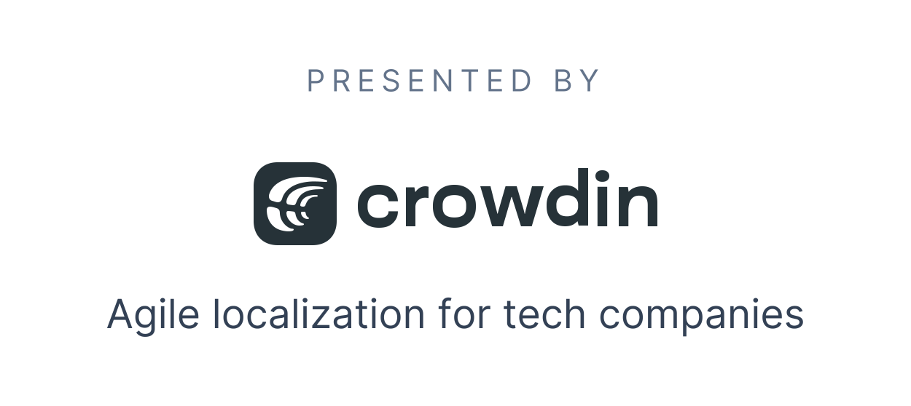

<div align="center">
<h1>Lingui<sub>js</sub></h1>

🌍📖 A readable, automated, and optimized (2 kb) internationalization for JavaScript

<hr />

![Main Suite][Badge-MainSuite-GithubCI]
![Release Workflow Testing][Badge-ReleaseWorkflowTesting-GithubCI]
[![Code Coverage][Badge-Coverage]][Coverage]
[![PRs Welcome][Badge-PRWelcome]][PRWelcome]
[![Join the community on Discord][Badge-Discord]][Discord]

[**Documentation**][Documentation] · [**Quickstart**](#quickstart) · [**Example**](#example) · [**Support**](#support) · [**Contribute**](#contribute) · [**License**](#license)

</div>

> Internationalization is the design and development of a product, application or document content that enables easy localization for target audiences that vary in culture, region, or language.
>
> --- [ W3C Web Internationalization FAQ](https://www.w3.org/International/questions/qa-i18n)

Lingui is an easy yet powerful internationalization (i18n) framework for global projects.

- **Clean and readable** - Keep your code clean and readable, while the library uses battle-tested and powerful **ICU MessageFormat** under the hood.

- **Universal** - Use it everywhere. `@lingui/core` provides the essential intl functionality which works in any JavaScript project while `@lingui/react` offers components to leverage React rendering, including React Server Components (RSC) support.

- **Full rich-text support** - Use React components inside localized messages without any limitation. Writing rich-text messages is as easy as writing JSX.

- **Powerful tooling** - Manage your intl workflow with the Lingui [CLI](https://lingui.dev/ref/cli), [Vite Plugin](https://lingui.dev/ref/vite-plugin), and [ESLint Plugin](https://lingui.dev/ref/eslint-plugin). The CLI extracts, compiles and validates messages, while the Vite plugin compiles catalogs on the fly, and the ESLint plugin helps catch common usage errors.

- **Unopinionated** - Integrate Lingui into your existing workflow. It supports message keys as well as auto-generated messages. Translations are stored either in JSON or standard PO files, which are supported in almost all translation tools.

- **Lightweight and optimized** - Core library is less than [2 kB gzipped](https://bundlephobia.com/result?p=@lingui/core), React components are additional [1.3 kB gzipped](https://bundlephobia.com/result?p=@lingui/react).

- **Active community** - Join the growing [community of developers](https://lingui.dev/community) who are using Lingui to build global products.

- **Compatible with react-intl** - Low-level React API is very similar to react-intl and the message format is the same. It's easy to migrate an existing project.

## Example

Short example how i18n looks with JSX:

```js
import { Trans } from "@lingui/react/macro"

function App() {
  return (
    <Trans
      id="msg.docs" // Optional message id
      comment="Docs link on the website" // Comment for translators, optional
    >
      Read the <a href="https://lingui.dev">documentation</a>
      for more info.
    </Trans>
  )
}
```

Message from this component will be extracted in following format:

```po
msgid "msg.docs"
msgstr "Read the <0>documentation</0> for more info."
```

For more example see the [Examples](https://github.com/lingui/js-lingui/tree/main/examples) directory.

## Support

If you are having issues, please let us know.

- Join us on [Discord][Discord] to chat with the community.
- Ask questions on [StackOverflow](https://stackoverflow.com/questions/ask?tags=linguijs) and mark it with the [`linguijs`](https://stackoverflow.com/questions/tagged/linguijs) tag.
- If something doesn't work as documented, documentation is missing or if you just want to suggest a new feature, [create an issue][Issues].
- You can also [Ask Lingui JS Guru](https://gurubase.io/g/lingui-js), it is a Lingui JS focused AI to answer your questions.

## Docs for LLMs

For developers working with AI and language models, we provide specialized documentation files following the [llms.txt specification](https://llmstxt.org/):

- [llms.txt](https://lingui.dev/llms.txt) - Concise documentation optimized for LLM context windows
- [llms-full.txt](https://lingui.dev/llms-full.txt) - Comprehensive documentation including all referenced URLs

These files provide LLM-friendly content in a standardized format, helping language models understand and work with Lingui's documentation at inference time. The format is designed to be both human and LLM readable, with structured information that can be processed programmatically.

## Contribute

Contribution to open-source project is everything from spreading the word, writing documentation to implement features and fixing bugs.

- Do you use **Lingui** in production site? Let us know!
- Have you seen any interesting talk or article about **i18n**? [Share it](https://github.com/lingui/js-lingui/edit/main/website/docs/misc/resources.md)!
- Have you found a bug or do you want to suggest a new feature? [Create an issue][Issues]!
- Do you want to improve the docs and write some code? Read the [contributors guide][Contributing] and send a PR!

### Contributors

This project exists thanks to [all the people][Contributors] who contribute. [[Contribute](CONTRIBUTING.md)].

## License

The project is licensed under the [MIT][License] license.

<div align="center">
  <a href="https://crowdin.com/?utm_source=lingui.dev&utm_medium=referral&utm_campaign=lingui.dev" target="_blank">
    
  </a>
</div>

[Documentation]: https://lingui.dev
[Examples]: https://github.com/lingui/js-lingui/tree/main/examples
[Badge-MainSuite-GithubCI]: https://github.com/lingui/js-lingui/workflows/main-suite/badge.svg
[Badge-ReleaseWorkflowTesting-GithubCI]: https://github.com/lingui/js-lingui/workflows/release-workflow-test/badge.svg
[Badge-Coverage]: https://img.shields.io/codecov/c/github/lingui/js-lingui/main.svg
[Badge-PRWelcome]: https://img.shields.io/badge/PRs-welcome-brightgreen.svg?style=flat-square
[Badge-Discord]: https://img.shields.io/discord/974702239358783608.svg?label=Discord&logo=Discord&colorB=7289da&style=flat-square
[Contributors]: https://github.com/lingui/js-lingui/graphs/contributors
[Coverage]: https://codecov.io/gh/lingui/js-lingui
[License]: https://github.com/lingui/js-lingui/blob/main/LICENSE
[Contributing]: https://github.com/lingui/js-lingui/blob/main/CONTRIBUTING.md
[Issues]: https://github.com/lingui/js-lingui/issues/new/choose
[PRWelcome]: http://makeapullrequest.com
[Discord]: https://discord.gg/gFWwAYnMtA
