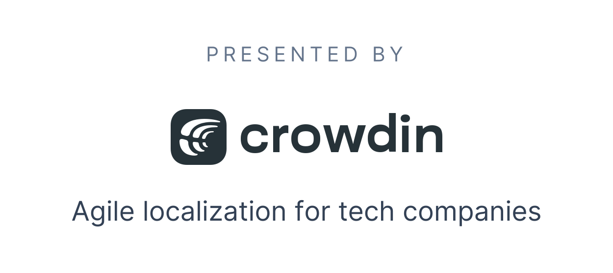

<div align="center">
<h1>Lingui<sub>js</sub></h1>

Lingui is a lightweight, open-source internationalization (i18n) library for JavaScript and TypeScript. Your source text stays in the code: compile-time macros turn it into ICU MessageFormat, and a CLI extracts and compiles the message catalogs. It works with React (including React Server Components and React Native), SolidJS, Vue, Node.js, and vanilla JS.

About 2 kB gzipped core · 6M+ npm downloads a month · MIT licensed

<hr />

![Main Suite][Badge-MainSuite-GithubCI]
![Release Workflow Testing][Badge-ReleaseWorkflowTesting-GithubCI]
[![Code Coverage][Badge-Coverage]][Coverage]
[![PRs Welcome][Badge-PRWelcome]][PRWelcome]
[![Join the community on Discord][Badge-Discord]][Discord]

[**Documentation**][Documentation] · [**Quick Start**](#quick-start) · [**Why Lingui**](#why-lingui) · [**Support**](#support) · [**Contribute**](#contribute) · [**License**](#license)

</div>

## Quick Start

```bash
npm install @lingui/core @lingui/react
npm install --save-dev @lingui/cli
```

Lingui macros run at build time, so add the macro plugin for your transpiler and create a `lingui.config.js`. The [installation guide](https://lingui.dev/installation) covers both in a few minutes.

Then wrap the text you want to translate in the `Trans` macro. There are no message IDs to invent and no separate JSON file to keep in sync:

```jsx
import { i18n } from "@lingui/core"
import { I18nProvider } from "@lingui/react"
import { Trans } from "@lingui/react/macro"
import { messages } from "./locales/en/messages"

i18n.load("en", messages)
i18n.activate("en")

export function App() {
  return (
    <I18nProvider i18n={i18n}>
      <Trans>
        Read the <a href="https://lingui.dev">documentation</a> for more info.
      </Trans>
    </I18nProvider>
  )
}
```

Extract the messages into PO catalogs, translate them, then compile the catalogs into optimized runtime output:

```bash
npx lingui extract
npx lingui compile
```

After translation, the Czech catalog in `src/locales/cs/messages.po` looks like this. The `<0>` tag stands for the `<a>` element, so translators never touch your markup:

```po
#: src/App.jsx:12
msgid "Read the <0>documentation</0> for more info."
msgstr "Přečtěte si <0>dokumentaci</0> pro více informací."
```

Continue with the [React tutorial](https://lingui.dev/tutorials/react), or jump to [React Server Components](https://lingui.dev/tutorials/react-rsc), [React Native](https://lingui.dev/tutorials/react-native), [SolidJS](https://lingui.dev/tutorials/solid), or [plain JavaScript](https://lingui.dev/tutorials/javascript). Working projects for Vite, Next.js, Remix, TanStack Start, React Native and more live in the [examples](https://github.com/lingui/js-lingui/tree/main/examples) directory.

## Why Lingui

In key-based i18n libraries you invent a key, put the text in a JSON file, and reference the key from the code. With Lingui, the text stays where it is read:

```jsx
// Key-based i18n: the code holds a key, the text lives somewhere else
<h1>{t("dashboard.welcome.title")}</h1>

// Lingui: the text is the source of truth, the catalog is generated from it
<h1>
  <Trans>Welcome back, {name}</Trans>
</h1>
```

The code reads like the UI it renders, and reviewers see the actual copy in the diff. Nobody has to name keys or look up what a key means. Running `lingui extract` regenerates the catalog from the source, so new messages are added and removed ones are marked obsolete without any manual bookkeeping. Translators get the real sentence with named placeholders, plus any comments and context you add. Message IDs are stable hashes generated at build time, and [explicit IDs](https://lingui.dev/guides/explicit-vs-generated-ids) are available when you need them.

On top of that:

- **Rich text without workarounds.** React components inside a message are as easy as writing JSX. Translators see numbered tags, and the catalog stays in sync with your components.

- **Compiled, not parsed at runtime.** Catalogs are compiled ahead of time, so the runtime ships without a MessageFormat parser. Core [](https://bundlejs.com/?q=%40lingui%2Fcore), React bindings [](https://bundlejs.com/?q=%40lingui%2Freact&config=%7B%22esbuild%22%3A%7B%22external%22%3A%5B%22react%22%2C%22%40lingui%2Fcore%22%5D%7D%7D).

- **One library for the whole stack.** `@lingui/core` works in any JavaScript project. `@lingui/react` adds components and hooks, including React Server Components support, and `@lingui/solid` brings native SolidJS bindings. React Native uses the same extract-and-compile workflow, Vue single-file components are supported through `@lingui/extractor-vue`, and Astro and Svelte work through community packages.

- **Standard formats and real tooling.** Translations live in PO files by default, which every translation tool understands, or in JSON, CSV, or a custom format. Messages carry comments and context for translators and machine translation. The [CLI](https://lingui.dev/ref/cli) extracts, compiles and validates, the [Vite plugin](https://lingui.dev/ref/vite-plugin) compiles catalogs on the fly, the [SWC plugin](https://lingui.dev/ref/swc-plugin) replaces Babel, and the [ESLint plugin](https://lingui.dev/ref/eslint-plugin) catches common mistakes.

## Who Uses Lingui

Lingui runs in production at Bluesky, ElevenLabs, Linkerd, GDevelop, Documenso, Gamma, Twenty, Superset, Notesnook, Inkeep and many more. See the [showroom](https://lingui.dev/misc/showroom) for the full list, and add your project if it is missing.

## Requirements

- Node.js 22.19 or newer.
- Lingui 6 packages are ESM-only. Modern bundlers and Node.js versions with `require(esm)` handle this transparently. See the [migration guide](https://lingui.dev/releases/migration-6).
- Macros need Babel with `@lingui/babel-plugin-lingui-macro` or SWC with `@lingui/swc-plugin`.
- `@lingui/react` supports React 16.14 and newer, including React 19.

## Docs for AI Agents

- Every documentation page is available as Markdown by appending `.md` to its URL, for example [lingui.dev/installation.md](https://lingui.dev/installation.md).
- [lingui.dev/llms.txt](https://lingui.dev/llms.txt) indexes the docs and [lingui.dev/llms-full.txt](https://lingui.dev/llms-full.txt) contains them in full.
- [Context7](https://context7.com/lingui/js-lingui) serves the latest docs over MCP. Add `use context7` to a prompt.
- [`lingui/skills`](https://github.com/lingui/skills) packages Lingui best practices as Agent Skills for Claude Code, Cursor, Codex, Gemini CLI, GitHub Copilot and other compatible agents. Install with `npx skills add lingui/skills`.

See [i18n with AI](https://lingui.dev/ai-tools) for the details.

## Support

If you are having issues, please let us know.

- Join us on [Discord][Discord] to chat with the community.
- Ask questions on [StackOverflow](https://stackoverflow.com/questions/ask?tags=linguijs) and mark it with the [`linguijs`](https://stackoverflow.com/questions/tagged/linguijs) tag.
- If something doesn't work as documented, documentation is missing or if you just want to suggest a new feature, [create an issue][Issues].
- You can also [Ask Lingui JS Guru](https://gurubase.io/g/lingui-js), it is a Lingui JS focused AI to answer your questions.

## Contribute

Contribution to open-source project is everything from spreading the word, writing documentation to implement features and fixing bugs.

- Do you use **Lingui** in production site? Let us know!
- Have you seen any interesting talk or article about **i18n**? [Share it](https://github.com/lingui/js-lingui/edit/main/website/docs/misc/resources.md)!
- Have you found a bug or do you want to suggest a new feature? [Create an issue][Issues]!
- Do you want to improve the docs and write some code? Read the [contributors guide][Contributing] and send a PR!

### Contributors

This project exists thanks to [all the people][Contributors] who contribute. [[Contribute](CONTRIBUTING.md)].

## License

The project is licensed under the [MIT][License] license.

<div align="center">
  <a href="https://crowdin.com/?utm_source=lingui.dev&utm_medium=referral&utm_campaign=lingui.dev" target="_blank">
    
  </a>
</div>

[Documentation]: https://lingui.dev
[Badge-MainSuite-GithubCI]: https://github.com/lingui/js-lingui/workflows/main-suite/badge.svg
[Badge-ReleaseWorkflowTesting-GithubCI]: https://github.com/lingui/js-lingui/workflows/release-workflow-test/badge.svg
[Badge-Coverage]: https://img.shields.io/codecov/c/github/lingui/js-lingui/main.svg
[Badge-PRWelcome]: https://img.shields.io/badge/PRs-welcome-brightgreen.svg?style=flat-square
[Badge-Discord]: https://img.shields.io/discord/974702239358783608.svg?label=Discord&logo=Discord&colorB=7289da&style=flat-square
[Contributors]: https://github.com/lingui/js-lingui/graphs/contributors
[Coverage]: https://codecov.io/gh/lingui/js-lingui
[License]: https://github.com/lingui/js-lingui/blob/main/LICENSE
[Contributing]: https://github.com/lingui/js-lingui/blob/main/CONTRIBUTING.md
[Issues]: https://github.com/lingui/js-lingui/issues/new/choose
[PRWelcome]: http://makeapullrequest.com
[Discord]: https://discord.gg/hdNuF3rupQ
