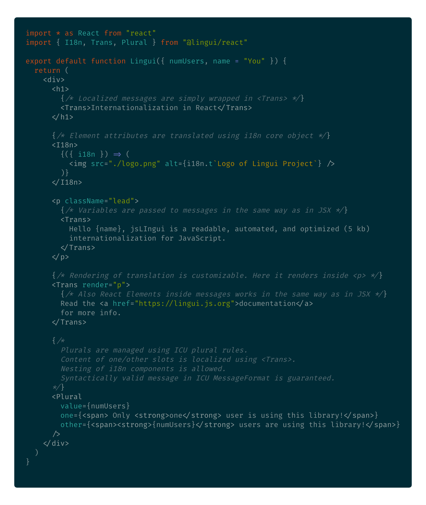
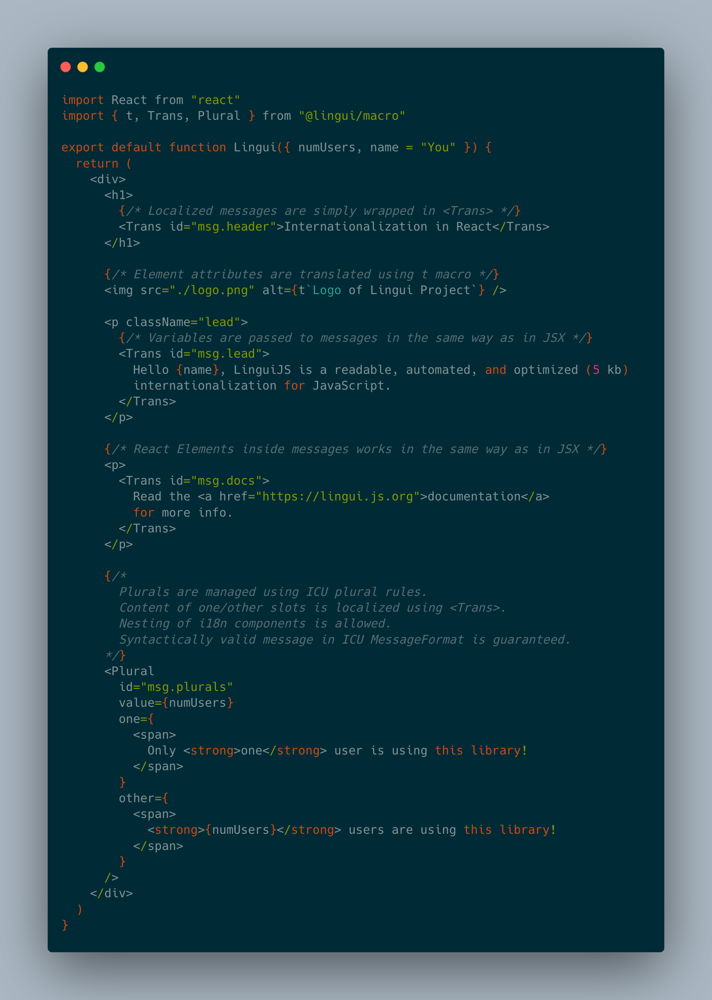

jsLingui - Seamless i18n in Javascript and React
================================================

Type-checked and intuitive way to internationalize applications in Javascript and React.

   **Internationalization** is the design and development of a product, application
   or document content that enables easy **localization** for target audiences that
   vary in culture, region, or language.

   --- `W3C Web Internationalization FAQ <https://www.w3.org/International/questions/qa-i18n>`_

Key features
------------

- Lightweight - about `5kb gzipped <https://github.com/lingui/js-lingui/blob/master/scripts/build/results.json>`_
  (1.9 kB core, 3.1 kB React components)
- Full support of **ICU MessageFormat** with extension to support HTML
- Unopinionated - supports manual and auto-generated message IDs out-of-the-box
- Batteries included - **CLI** for working with message catalogs
  (extracting, validating, compiling, …)
- Easy to migrate from react-intl

   Example with React

   Example with React using message IDs

.. toctree::
   :maxdepth: 1
   :caption: Tutorials

   React <tutorials/react>
   React - common patterns <tutorials/react-patterns>
   React Native <tutorials/react-native>
   JavaScript <tutorials/javascript>
   CLI <tutorials/cli>

.. toctree::
   :maxdepth: 1
   :caption: Guides

   Testing <guides/testing>
   Typescript <guides/typescript>
   Excluding build files <guides/excluding-build-files>
   Dynamic loading of translations <guides/dynamic-loading-catalogs>
   Optimized components <guides/optimized-components>
   How plurals work <guides/plurals>

.. toctree::
   :maxdepth: 1
   :caption: API References

   Core (JavaScript) <ref/core>
   React <ref/react>
   CLI <ref/cli>
   Configuration <ref/conf>
   Webpack Loader <ref/loader>
   ICU MessageFormat <ref/message-format>

.. toctree::
   :maxdepth: 1
   :caption: Releases

   Migration from 1.x to 2.x <releases/migration-2>
   Migration from 0.x to 1.x <releases/migration-1>

.. toctree::
   :maxdepth: 1
   :caption: Discussion

   Projects using jsLingui <misc/showroom>
   Comparison with react-intl <misc/react-intl>
   Talks and articles about i18n in JavaScript <misc/talks-about-i18n>
   RFCs and design decisions <rfc/toc>

Indices
-------

* :ref:`genindex`
* :ref:`search`
