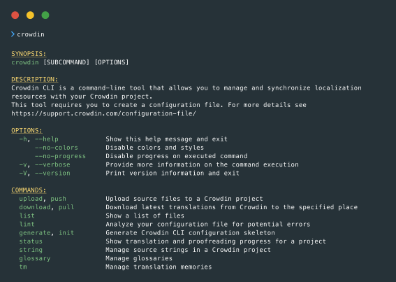

Crowdin
=======

.. image:: https://support.crowdin.com/assets/logos/crowdin-logo-small-example@2x.png
   :alt: Crowdin agile localization for developers
   :width: 300

**Agile localization for developers.**

Crowdin is a localization management platform that helps translate your
LinguiJS-based product. Automate localization, release several
multilingual versions of your app simultaneously, and provide an
enhanced experience for your global customers.

`Website <https://crowdin.com/>`__ \|
`GitHub <https://github.com/crowdin>`__ \|
`Support <https://crowdin.com/contacts>`__

Features
--------

Keep all translations in one place while connecting your teams via Crowdin
~~~~~~~~~~~~~~~~~~~~~~~~~~~~~~~~~~~~~~~~~~~~~~~~~~~~~~~~~~~~~~~~~~~~~~~~~~

Connect with your content, marketing, and translation teams in one collaborative space:

- Screenshots for additional context.
- Highlight HTML, placeholders, plurals, and more.
- Describe the context and set character limits to ensure the translation fits the UI.
- All translations are done online or can be uploaded to the platform.
- Jira integration to notify you about source string issues.
- Tips for translators to ensure there is no extra space or broken code.

Ship faster with localization running in parallel
~~~~~~~~~~~~~~~~~~~~~~~~~~~~~~~~~~~~~~~~~~~~~~~~~

Keep developing new features and improvements while translators receive
new texts in real-time. Release multilingual versions for customers
around the globe simultaneously.

Release your product in several languages at once
~~~~~~~~~~~~~~~~~~~~~~~~~~~~~~~~~~~~~~~~~~~~~~~~~

Help users from different regions use the latest version of your product in their language:

- Get feature branches translated independently from the master branch.
- Translators work together in one place to boost productivity.
- Never deal with translations in spreadsheets or email attachments.
- Source texts are updated for translators automatically and in real-time.
- Automatically pull completed translations that are ready to be merged.

Seamlessly integrate localization during any phase of your development cycle
~~~~~~~~~~~~~~~~~~~~~~~~~~~~~~~~~~~~~~~~~~~~~~~~~~~~~~~~~~~~~~~~~~~~~~~~~~~~

Automate the integration of source texts and translations between
Crowdin and your source code with one-click integration or customizable
solutions.

Define your translation strategy
~~~~~~~~~~~~~~~~~~~~~~~~~~~~~~~~

Decide who will translate your content:

- Invite your team of translators (in-house translators, freelancers, or translation agencies you already work with).
- Order professional translations from a vendor (translation agency) from Crowdin Vendors Marketplace.
- Configure machine translation engines.
- Engage your community.

VCS: GitHub, GitLab, Bitbucket
~~~~~~~~~~~~~~~~~~~~~~~~~~~~~~

Source strings are pulled automatically and are always up to date for
your translators. Translated content is automatically pushed to your
repository as a request.

.. image:: ./Crowdin__js-lingui-vcs.png
   :alt: Automatically pull source strings to Crowdin and push translated content to your repository
   :width: 700

CLI
~~~

Easily integrate Crowdin with your CI server, GIT, SVN, Mercurial, etc.
Connect cross-platform `Crowdin
CLI <https://support.crowdin.com/cli-tool/>`__ directly to your code
repository and never deal with localization files manually again.

1. Create the ``crowdin.yml`` configuration file
~~~~~~~~~~~~~~~~~~~~~~~~~~~~~~~~~~~~~~~~~~~~~~~~

.. code-block:: yaml

  project_id: '123456' # Your Crowdin project ID
  api_token_env: CROWDIN_PERSONAL_TOKEN

  preserve_hierarchy: true

  files: # Paths to the source and translation files
    - source: /**/locales/en/*
      translation: /**/locales/%two_letters_code%/%original_file_name%

2. Install the Crowdin CLI as an npm package
~~~~~~~~~~~~~~~~~~~~~~~~~~~~~~~~~~~~~~~~~~~~

.. code-block:: sh

  npm install @crowdin/cli@3

3. Add the following scripts
~~~~~~~~~~~~~~~~~~~~~~~~~~~~

Add these lines to your ``package.json`` to make your life easier.

.. code-block:: js

  {
    "scripts": {
      "crowdin": "crowdin",
      "sync": "crowdin push && crowdin pull",
      "sync:sources": "crowdin push",
      "sync:translations": "crowdin pull"
    }
  }

4. Configuration
~~~~~~~~~~~~~~~~

Set the ``CROWDIN_PERSONAL_TOKEN`` env variable on your computer, to allow the CLI to authenticate with the Crowdin API.

5. Usage
~~~~~~~~

Test that you can run the Crowdin CLI:

.. code-block:: sh

  npm run crowdin --version

Upload all the source files to Crowdin:

.. code-block:: sh

  npm run sync:sources

Download translation files from Crowdin:

.. code-block:: sh

  npm run sync:translations

Upload sources to Crowdin and download translations from Crowdin:

.. code-block:: sh

  npm run sync

To run other Crowdin CLI commands you can use the following command:

.. code-block:: sh

  npm run crowdin <command> <options>

To see the full list of possible commands and options:

.. code-block:: sh

  npm run crowdin -h

`API <https://support.crowdin.com/api/v2/>`__ and webhooks
~~~~~~~~~~~~~~~~~~~~~~~~~~~~~~~~~~~~~~~~~~~~~~~~~~~~~~~~~~

Customize your experience. Automate and scale your localization
workflow. Seamlessly add new content for translation to your Crowdin
project, check translation status, merge new content, etc.

To get started, register a `Crowdin.com <https://accounts.crowdin.com/register>`__ or `Crowdin Enterprise <%5Bhttps://accounts.crowdin.com/workspace/create%5D(https://accounts.crowdin.com/workspace/create)>`__ account.
~~~~~~~~~~~~~~~~~~~~~~~~~~~~~~~~~~~~~~~~~~~~~~~~~~~~~~~~~~~~~~~~~~~~~~~~~~~~~~~~~~~~~~~~~~~~~~~~~~~~~~~~~~~~~~~~~~~~~~~~~~~~~~~~~~~~~~~~~~~~~~~~~~~~~~~~~~~~~~~~~~~~~~~~~~~~~~~~~~~~~~~~~~~~~~~~~~~~~~~~~~~~~~~~~~~~~~~~~~

Once you have signed up, we recommend `creating your localization
project <https://support.crowdin.com/creating-project/>`__.

Depending on the ways you would like to work with Crowdin, we offer such
options:

1. `Integrate Crowdin with GitHub <https://support.crowdin.com/github-integration/>`__.

2. Manage and synchronize your localization resources with `Crowdin CLI <https://support.crowdin.com/cli-tool/>`__.

3. `Upload files for the test via UI <https://support.crowdin.com/uploading-files/>`__.
