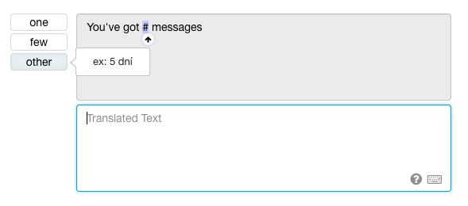

**************
Translation.io
**************

`Translation.io <https://translation.io/lingui>`_ is a professional
synchronization and collaboration platform that will assist your team
in the translation of your Lingui application.

Links:
  * Website: `https://translation.io/lingui <https://translation.io/lingui>`_
  * GitHub: `https://github.com/translation/lingui <https://github.com/translation/lingui>`_

Features
========

Smooth Team Management
----------------------

Invite your collaborators using their email or username, and assign them a
role and a target language. We'll bring them on board and keep them informed
about any new activity in their language.

.. image:: https://translation.io/gifs/lingui/translation-collaborators.gif
   :alt: Smooth Team Management on Translation.io
   :width: 500

Learn more:
  * `Fine-Grained Authorizations <https://translation.io/blog/fine-grained-authorization-and-role-management?default_stack=lingui>`_
  * `Activity Digests <https://translation.io/blog/better-history-and-activity-email-digests?default_stack=lingui>`_

Elegant Translation Process
---------------------------

Our interface was designed to be the most ergonomic way to translate. It
provides translation suggestions (from
`TM <https://en.wikipedia.org/wiki/Translation_memory>`_, Google Translate
or DeepL), context, discussion and history.

Keyboard shortcuts allow translators to stay focused on their work, visual
hints indicate when something went wrong, for example when an interpolated
variable or HTML tag is missing.

.. image:: https://translation.io/gifs/lingui/translation-interface.gif
   :alt: Elegant Translation Process on Translation.io
   :width: 600

Learn more:
  * `Keyboard Shortcuts <https://translation.io/blog/shortcuts-and-translation?default_stack=lingui>`_
  * `History and Activity Digests <https://translation.io/blog/better-history-and-activity-email-digests?default_stack=lingui>`_

Syntax Highlighting
-------------------

Sometimes you have no choice but to confront your translators with HTML or
interpolated variables. The problem is that translators do not necessarily
know the meaning of these notations and may be tempted to translate them
or may inadvertently alter them.

``Hello {name}`` should never be translated as ``Bonjour {nom}``, and we have several
mechanisms to ensure that, like warnings and auto-completion:

.. image:: https://translation.io/_articles/2019-10-11-highlighting-of-html-tags-and-interpolated-variables/highlight-interpolated-variable-lingui.png
   :alt: Syntax Highlighting warning on Translation.io
   :width: 600

----------

.. image:: https://translation.io/gifs/lingui/translation-highlights.gif
   :alt: Syntax Highlighting auto-completion on Translation.io
   :width: 500

Smart Plural Management
-----------------------

Lingui allows to write plurals using the
`ICU MessageFormat <../ref/message-format.html>`_ syntax that looks like this:

.. code-block:: none

     {count, plural, =0 {No messages}
                     one {# message}
                     other {# messages}}

But you can't ask a translator to understand this syntax, and he or she would
be tempted to translate ``one`` or ``other`` keywords in other languages,
breaking your code at the same time.

That's why we deconstruct the plural syntaxes to make them easy to translate, and
then reconstruct them inside your local ``.po`` files.

If the target language has more plural forms than the source language,
we also provide some examples to the translator, because it could be unclear what
plural form the ``few`` or ``other`` keyword may refer to in that specific
target language (in this example, Czech has 3 plural forms).

Efficient Search
----------------

Our powerful search helps translators to maintain consistency of terms
throughout their work. In addition, they are able to filter depending
on a particular source file or context. To provide a more enjoyable
experience, this lightning-fast search works without any page reloading.

.. image:: https://translation.io/gifs/lingui/translation-search.gif
   :alt: Efficient Search on Translation.io
   :width: 500

Learn more:
  * `Smart URLs <https://translation.io/blog/smart-urls-in-translation-interface?default_stack=lingui>`_

Adaptive Workflows using Tags
-----------------------------

Our interface is flexible enough to adapt to your own translation workflows.
Add custom tags to your segments and you'll be directly able to filter them.
Moreover, these tags will appear in the statistics page so you can use them for
reporting.

.. image:: https://translation.io/gifs/lingui/translation-tags.gif
   :alt: Adaptive Workflows using Tags on Translation.io
   :width: 500

Learn more:
  * `How to Use Tags <https://translation.io/blog/tags-work-better-as-a-team?default_stack=lingui>`_
  * `Project Statistics <https://translation.io/blog/translation-project-statistics?default_stack=lingui>`_

Installation
============

1. Create your Lingui project
-----------------------------

Create an account on `Translation.io <https://translation.io/lingui>`_
and create a new Lingui project.

2. Configure your application
-----------------------------

Copy the ``.linguirc`` configuration file that was generated for you to the
root of your application.

The configuration file looks like this:

.. code-block:: js

  {
    [...]
    "format": "po",
    "service": {
      "name": "TranslationIO",
      "apiKey": "abcdefghijklmnopqrstuvwxyz012345"
    }
  }

3. Add the following scripts
----------------------------

Add these lines to your ``package.json`` to make your life easier.

.. code-block:: js

  {
    "scripts": {
      "sync": "lingui extract --overwrite && lingui compile",
      "sync_and_purge": "lingui extract --overwrite --clean && lingui compile"
    }
  }

4. Initialize your project
--------------------------

Initialize your project and upload your source text and potential existing translations with:

.. code-block:: sh

  # NPM
  npm run sync

  # Yarn
  yarn sync

Usage
=====

Sync
----

To send new translatable strings and get new translations from Translation.io,
and at the same time generate the minified JavaScript catalog files, simply run:

.. code-block:: sh

  # NPM
  npm run sync

  # Yarn
  yarn sync

Sync and Purge
--------------

If you need to remove unused strings from Translation.io, using the current
branch as reference.

As the name says, this operation will also perform a sync at the same time.

**Warning**: all strings that are not present in the current local branch will be
**permanently deleted from Translation.io**.

.. code-block:: sh

  # NPM
  npm run sync_and_purge

  # Yarn
  yarn sync_and_purge

----------------

If you need some help with your project, feel free to contact contact@translation.io

