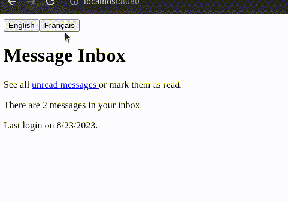

# Lingui + RSpack Example

This project shows how to use the [Rspack JavaScript bundler](https://www.rspack.dev/guide/introduction.html) with [Lingui JS](https://lingui.dev/) to provide i18n for a React application (TypeScript).

## Setup Instructions

1. `npm install` to install dependencies
2. `npm run dev` to run the development server.
3. `npm run build` to build the application.

## Update I18n

1. Wrap any messages requiring translation in `<Trans>` or a related macro.
2. `npm run extract` to generate message catalogs in `src/locales/{locale}/messages`.
3. Translate any new messages in the catalogs.
4. Restart the dev server or rebuild the app. `@lingui/loader` compiles `.po` catalogs during bundling, so no separate `lingui compile` step is required.

## Configuration File Notes

- [`rspack.config.js`](./rspack.config.js) configures both the [`builtin:swc-loader`](https://www.rspack.dev/guide/builtin-swc-loader.html#builtinswc-loader) and `@lingui/loader`. The SWC plugin transpiles [Lingui Macros](https://lingui.dev/ref/macro) like `<Trans>` into their React runtime equivalents, while `@lingui/loader` turns imported `.po` catalogs into runtime messages at build time. When using Lingui SWC plugin, ensure version compatibility with `@rspack/core`. Refer to the [compatibility guide](https://github.com/lingui/swc-plugin#compatibility) for selecting the appropriate plugin version.

- [`src/i18n.ts`](./src/i18n.ts) lazy-loads locale catalogs from `src/locales/{locale}/messages.po`, which lets `rspack` split translations into separate chunks and compile them through `@lingui/loader`.

- [`lingui.config.ts`](./lingui.config.ts) specifies the available locales, defaults, and paths where the message catalogs are stored.

## Helpful Resources

- This [blog post](https://betterprogramming.pub/react-app-internationalization-with-linguijs-9486ccd80e07) shows a step-by-step guide to set up LinguiJS with React.
- [Official documentation for React setup with LinguiJS](https://lingui.dev/tutorials/react). This repo closely follows the example from the official docs.
