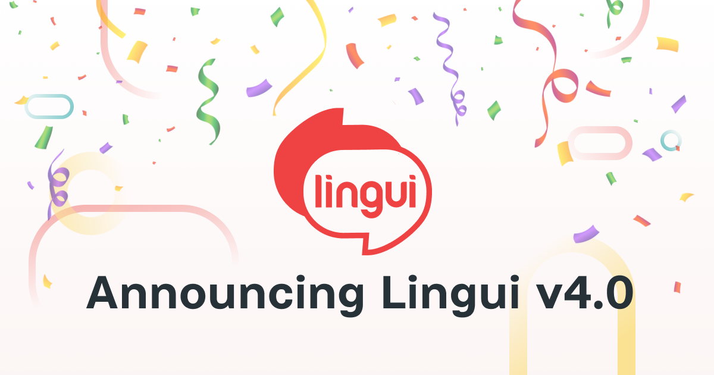

Today we are happy to finally announce Lingui 4.0! 🥳️

---

## What is Lingui exactly?

Lingui is a powerful and flexible **internationalization** (i18n) and **localization** (l10n) library for JavaScript projects, including React, Vue.js, Node.js, Next.js, Angular, and more. It provides a set of tools and APIs that make it easy for developers to create multilingual applications.

One of the key benefits of Lingui is that it simplifies the process of managing translations by providing a centralized way to store and manage translation files.

### Key features

- **Clean and readable** - keep your code clean and readable, while the library uses the battle-tested and powerful ICU MessageFormat under the hood.
- **Universal** - use it everywhere: Vanilla JS, React, Vue.js, Next.js, Node.js, etc.
- **Full rich-text support** - use React components within localized messages without restriction. Writing rich-text messages is as easy as writing JSX.
- **Powerful tooling** - manage the entire intl workflow with [Lingui CLI](https://lingui.dev/tutorials/cli). It extracts messages from source code, validates messages coming from translators, and verifies that all messages are translated before shipping to production.
- **Unopinionated** - integrate Lingui with your existing workflow. It supports both message keys and auto-generated messages. Translations can be stored in a [variety of file formats](https://lingui.dev/ref/catalog-formats) including PO, JSON, and CSV.
- **Lightweight and optimized** - core library is only [1.5 kB gzipped](https://bundlephobia.com/result?p=@lingui/core), React components are additional [1.3 kB gzipped](https://bundlephobia.com/result?p=@lingui/react).
- [Active community](https://lingui.dev/misc/community).

## What's new in 4.0?

This version is packed with tons of new features, improvements and fixes that will make internationalizing your JavaScript projects much easier!

The codebase has also been significantly refactored and updated. As a result, Lingui has become much more stable, lightweight, reliable, and less fragile.

### Extractors

The big change in v4.0 is in the extractor internals. It is now less fragile and doesn't depend on host project settings. Also, the extractor now supports TypeScript out of the box.

#### Hash-based message IDs + Context

The previous implementation had a flaw: there is an original message in the bundle at least 2 times + 1 translation.

For the line "Hello world", it will exist in the source as an ID in the i18n call, then as a key in the message catalog, and then as the translation itself. Strings can be very long, not just a few words, so this may add more kB to the bundle.

A much better option is to generate a "stable" ID based on the `msg` + `context` as a fixed length hash.

We've also added the ability to specify a **context** for the message. For more details, see the [Providing a context for a message](https://lingui.dev/tutorials/react-patterns#providing-a-context-for-a-message).

The context feature affects the message ID generation and adds the `msgctxt` parameter in case of the PO catalog format extraction.

#### Custom Extractors

The extractor refactoring has allowed the creation of **Custom Extractors**. If your project does not work well with Lingui's extractor, you can easily write your own extractor implementation. This might be the case if you are using some experimental features (stage0 - stage2) or frameworks with custom syntax like Vue.js or Svelte. See the [Custom Extractor](https://lingui.dev/guides/custom-extractor) guide for more details.

:::tip
Thanks to this feature, we have implemented a [Vue.js Extractor](https://lingui.dev/tutorials/extractor-vue) that is already successfully integrated into Vue.js projects!
:::

#### Flow Syntax support

Lingui supports [Flow](https://flow.org/) by default. If your project uses Flow, you need to explicitly [enable support](https://lingui.dev/guides/flow) in the extractor.

### Custom Formatters

If your project requires a special format or handling logic, you can write your own format implementation.

Formatter is a simple object with 2 main functions `parse` and `serialize`, which should take Lingui catalog and serialize it to string and vice versa.

You don't need to create a separate package for formatter, you can write it directly in `lingui.config.{ts,js}`.

The built-in Lingui formatters have been extracted into a separate packages:

- [@lingui/format-po](https://www.npmjs.com/package/@lingui/format-po) (enabled by default)
- [@lingui/format-po-gettext](https://www.npmjs.com/package/@lingui/format-po-gettext)
- [@lingui/format-json](https://www.npmjs.com/package/@lingui/format-json)
- [@lingui/format-csv](https://www.npmjs.com/package/@lingui/format-csv)

See the [Custom Formatter](https://lingui.dev/guides/custom-formatter) guide for more details.

### Experimental dependency tree crawling

While the standard glob-based extraction process is effective for most projects, multipage (MPA) frameworks such as NextJS pose a problem because the glob-based approach creates a catalog consisting of all messages from all pages.

This means that the entire catalog must be loaded for each page/navigation, which results in loading messages that are not used on that page.

To address this issue, a new experimental extractor was introduced in version 4. This extractor uses the dependency tree of files, rather than just a glob pattern, to crawl imports and discover files more accurately.

By doing so, it creates a more optimized catalog that only contains the messages needed for each page.

The catalogs would still contain duplicate messages for common components, but it would be much better than the current approach.

:::tip
See the [Message Extraction](https://lingui.dev/guides/message-extraction) guide to learn more about how message extraction works.
:::

### Improved React support

Lingui v4.0 includes a bunch of improvements to its React support, making it even easier for developers to implement internationalization and localization in their React applications. Visit the [Internationalization of React apps](https://lingui.dev/tutorials/react) and [Common i18n patterns in React](https://lingui.dev/tutorials/react-patterns) tutorials to learn the most common patterns for internationalizing React applications.

### Plugins

During the development of Lingui v4.0, we have created two new plugins to improve the integration of Lingui with other tools and frameworks. These plugins are the [SWC Plugin](https://lingui.dev/ref/swc-plugin) and the [Vite Plugin](https://lingui.dev/ref/vite-plugin).

Both of these plugins are designed to make it easier for developers to use Lingui with other modern tools and frameworks. We are excited to see how developers will use these plugins to improve their localization workflows and make their applications more accessible to a global audience.

### More examples

As part of Lingui v4.0, we've also created new example projects that show how Lingui can be integrated into different types of applications. These projects demonstrate best practices for integrating Lingui with popular frameworks and libraries, including [nextjs-babel](https://github.com/lingui/js-lingui/tree/main/examples/nextjs-babel), [nextjs-swc](https://github.com/lingui/js-lingui/tree/main/examples/nextjs-swc), [vite-project-react-babel](https://github.com/lingui/js-lingui/tree/main/examples/vite-project-react-babel), [nextjs-13](https://github.com/lingui/swc-plugin/tree/main/examples/nextjs-13) as well as the existing ones [create-react-app](https://github.com/lingui/js-lingui/tree/main/examples/create-react-app) and [js](https://github.com/lingui/js-lingui/tree/main/examples/js) were updated.

These example projects are a great resource for developers who are new to Lingui and want to see how it can be used in practice. They provide a clear starting point for building a multilingual application, and can help developers avoid common pitfalls and obstacles. We hope that these examples will inspire developers to try Lingui in their own projects and make their applications accessible to a wider audience.

## Other features

Lingui v4 comes with a long list of useful features:

- extractor: support TS experimental decorators
- macro: support tagged templates in `defineMessage` + short alias
- macro: allow passing any expression as custom i18n instance
- macro: support JSX macro inside conditional expressions
- macro: support renamed identifiers in macro
- core (Experimental): new core API for Node/JS usage without macros
- core: support extracting from all forms of `i18n._` / `i18n.t` calls
- extractor: respect sourcemaps

Visit the [Release notes](https://github.com/lingui/js-lingui/releases/tag/v4.0.0) to see all the updates.

## Credits

We would like to say thanks to all the [contributors](https://github.com/lingui/js-lingui/graphs/contributors) who made this release possible. It represents the hard work and dedication of a global community of developers who have contributed their time, expertise, and support.

We are also grateful to the entire community who provided valuable feedback, bug reports, and feature requests. Your contributions have helped shape and make Lingui better.

## See more

- [Migration guide from 3.x to 4.x](https://lingui.dev/releases/migration-4)
- [Lingui 4.0 full changelog](https://github.com/lingui/js-lingui/releases/tag/v4.0.0)
