Today we are pleased to announce the release of Lingui 5.0! :rocket:

This release is a **major milestone** for the project and includes a number of new features, improvements and bug fixes. In this post, we'll highlight some of the major changes in this release.

In line with the principles of [Semantic Versioning](https://semver.org/), this release contains **breaking changes** that we have thoroughly documented in the [v5 upgrade guide](/releases/migration-5).


<!--truncate-->

## What is Lingui?

Lingui is a powerful and flexible **internationalization** (i18n) and **localization** (l10n) library for JavaScript projects. It supports React (including RSC and React Native), Vanilla JS, Node.js, Vue.js and frameworks such as Next.js, Remix, and Svelte.

It provides a set of tools and APIs that make it easy for developers to create multilingual applications.

## Table of Contents

- [Progress Highlights](#progress-highlights)
  - [React Server Components (RSC) Support](#react-server-components-rsc-support)
  - [ESLint Plugin](#eslint-plugin)
  - [Metro Transformer](#metro-transformer)
- [What's New in 5.0?](#whats-new-in-5.0)
  - [React and JS Macros Were Split to Separate Packages](#react-and-js-macros-were-split-to-separate-packages)
  - [Whitespace Handling Changes](#whitespace-handling-changes)
  - [New `useLingui` Macro](#new-uselingui-macro)
  - [Standalone `babel-plugin-lingui-macro`](#standalone-babel-plugin-lingui-macro)
  - [Print Placeholder Values for Better Translation Context](#print-placeholder-values-for-better-translation-context)
  - [Other Features](#other-features)
  - [Documentation Updates](#documentation-updates)
- [Conclusion](#conclusion)

## Progress Highlights

Lingui has gone through a significant number of changes and milestones since the last major release.

Before we dive into the new features and improvements in 5.0, let's take a look at the growth of the project since the [4.0 release](/blog/2023/04/26/announcing-lingui-4.0) in April 2023.

The project has seen a significant increase in popularity since the last major release. The number of GitHub stars has increased by 28%, and the number of downloads per month has more than doubled for the `@lingui/core` and `@lingui/react` packages. The SWC and Vite plugins are also gaining a lot of traction.

```mermaid
%%{init: {"themeCSS": ".node rect { rx: 5; ry: 5; }"} }%%

graph LR
    subgraph APR2023["<b>April 2023</b>"]
        stars1["GitHub Stars ⭐<br/>3.6K"]

        subgraph downloads1["Downloads 📥 / month"]
            A1["@lingui/core<br/>580k"]
            A2["@lingui/react<br/>385k"]
            A3["@lingui/swc-plugin<br/>37k"]
            A4["@lingui/vite-plugin<br/>6k"]
        end
    end

    subgraph OCT2024["<b>October 2024</b>"]
        stars2["GitHub Stars ⭐<br/>4.6K"]

        subgraph downloads2["Downloads 📥 / month"]
            B1["@lingui/core<br/>1.3M"]
            B2["@lingui/react<br/>770k"]
            B3["@lingui/swc-plugin<br/>186k"]
            B4["@lingui/vite-plugin<br/>147k"]
        end
    end

    stars1 -->|"<b>ㅤ+28%ㅤ</b>"| stars2
    A1 -->|"<b>ㅤ+124%ㅤ</b>"| B1
    A2 -->|"<b>ㅤ+100%ㅤ</b>"| B2
    A3 -->|"<b>ㅤ+402%ㅤ</b>"| B3
    A4 -->|"<b>ㅤ+2350%ㅤ</b>"| B4

style stars1 stroke-width:2px,rx:20,ry:20
style stars2 stroke-width:2px,rx:20,ry:20
```



(_The download numbers are based on the [npm-stat.com](https://npm-stat.com/) data_)

The journey from [Lingui 4.0](/blog/2023/04/26/announcing-lingui-4.0) includes **25 version updates** (minor and patch), more than **100 closed issues**, and more than **150 merged pull requests**.

Let's now take a quick look at some of the major features and improvements that have been released between 4.0 and 5.0.

### React Server Components (RSC) Support

Lingui comes with out-of-the-box support for [React Server Components](https://react.dev/reference/rsc/server-components) (RSC). This allows you to render translations on the server and client using the same components.

With Lingui, the experience of localizing React is the same in client and server components: `Trans` and `useLingui` can be used identically in both worlds, even though internally there are two implementations.

:::tip
Lingui is fully compatible with the recently released [Next.js 15](https://nextjs.org/blog/next-15) with the Turbopack Dev bundler.
:::

📖 Read more in the [Lingui with React Server Components](/tutorials/react-rsc) tutorial.

### ESLint Plugin

The new [ESLint Plugin](/ref/eslint-plugin) is gaining popularity among developers. It helps catch common usage errors and enforce best practices when working with Lingui.

It's fully compatible with the latest ESLint versions and supports both the new ESLint Flat configuration (`eslint.config.js`) and the legacy configuration `.eslintrc` format. There is also a set of recommended rules that you can use to get started quickly.

📖 See the [Official repository](https://github.com/lingui/eslint-plugin) for more details.

Released in September 2023, the plugin now has over 100k downloads per month.

### Metro Transformer

Just recently, we released a new [Metro Transformer](/ref/metro-transformer) for React Native projects. It allows you to `import` `.po` files directly, instead of running `lingui compile` and `import`ing the resulting JavaScript (or TypeScript) files.

This is a great addition to the Lingui ecosystem and simplifies the workflow for React Native developers.

📖 See the [`@lingui/metro-transformer`](/ref/metro-transformer) reference for more details.

## What's New in 5.0? {#whats-new-in-5.0}

Lingui 5.0 includes over 50 merged pull requests, bringing new features, improvements, bug fixes, and documentation updates. Here are some of the key highlights of this release.

### React and JS Macros Were Split to Separate Packages

In Lingui 5.0, we split the React and JS macros into separate packages to make it easier to use Lingui in any JavaScript project.

The main motivation behind this change was to reduce the package size for projects that don't use React and to prepare for future improvements, especially the Vue.js integration.

The `@lingui/macro` package has been split into two separate entry points from the existing packages:

- `@lingui/react/macro` - for React (JSX) macros.
- `@lingui/core/macro` - for Core (JS) macros.

This allows developers to use Lingui macros in any JavaScript project without having to download the entire React package.

### Whitespace Handling Changes

Whitespace handling has been improved to provide greater consistency and meet developer expectations. Previously, Lingui's regex-based whitespace normalization in JSX macros sometimes produced unexpected results. With Lingui 5.0, Lingui now uses **JSX-specific whitespace rules**, producing predictable, clean output for React (JSX) macros.

For JS macros, whitespace normalization has been **completely removed** based on developer feedback, leaving whitespace intact in expressions - ideal for text that requires special formatting, such as markdown.

This change is breaking, meaning that some auto-generated message IDs may change. This could cause translations to lose their connection to the original message ID. To address this, you can use the translation memory capabilities of your translation management system (TMS) to restore translations for the updated message IDs.

### New `useLingui` Macro

In Lingui 5, we introduced a new [`useLingui`](/ref/macro#uselingui) macro that makes it easier to work with non-JSX messages within React components.

Take the following code snippet as an example:

```jsx
import { t, msg } from "@lingui/macro";
import { useLingui } from "@lingui/react";

function MyComponent() {
  const { i18n, _ } = useLingui();

  const a = t(i18n)`Text`;
  // or
  const b = _(msg`Second Text`);
}
```

With the new `useLingui` macro, you can simplify this code to:

```jsx
import { useLingui } from "@lingui/react/macro";

function MyComponent() {
  const { t } = useLingui();

  const a = t`Text`;
  const b = t`Second Text`;
}
```

Under the hood, the `useLingui` macro is transpiled to the runtime [`useLingui`](/ref/react#uselingui) hook.

### Standalone `babel-plugin-lingui-macro`

There are now two ways to use Lingui macros with Babel in your project. You can choose between the `babel-macro-plugin` and the standalone `@lingui/babel-plugin-lingui-macro`.

The new plugin offers faster transpiling and additional configuration options.

We recommend replacing `babel-macro-plugin` with `@lingui/babel-plugin-lingui-macro` if you have direct access to your Babel configuration and don't use any other macros in your project.

```diff title=".babelrc"
{
  "plugins": [
-    "macros"
+    "@lingui/babel-plugin-lingui-macro"
  ]
}
```

### Print Placeholder Values for Better Translation Context

Context is critical for translators (and AI) to provide accurate translations. This release introduces a new feature that prints placeholder values in PO comments.

If the message contains unnamed placeholders such as `{0}`, Lingui will print the name of the placeholder variable in the PO comments, giving translators and AI more context about what the placeholder is about.

Consider the following example:

```js
t`Hello ${user.name} ${value}`;
```

With the new feature enabled, the message in the PO file will include the placeholder values in the comments:

```diff title="en.po"
+ #. placeholder {0}: user.name
msgid "Hello {0} {value}"
```

This gives the translators more context about the placeholders, which definitely helps in providing accurate translations.

### Other Features

#### Configurable Message Stripping via Babel Options

By default, Lingui strips messages and comments from the production bundle to reduce the bundle size.

It's now possible to configure this feature by setting the `stripMessageField` option in the Babel configuration:

```js title="babel.config.js" {5-7}
module.exports = {
  plugins: [
    "macros",
    {
      lingui: {
        stripMessageField: true,
      },
    },
  ],
};
```

Setting `stripMessageField` to `true` will strip messages and comments from both development and production bundles. Alternatively, set it to `false` to keep the original messages in both environments.

This helps to align the development and production environments and catch potential issues early in the development process.

#### Support `decoratorAutoAccessors` Decorator

Decorators are a proposal for extending JavaScript classes that has been widely adopted by developers in transpiler environments, with widespread interest in standardization.

By default, Lingui supports Typescript, Flow, and JavaScript (Stage 3) syntax. The Decorators proposal is already at Stage 3, and Lingui now supports the `decoratorAutoAccessors` decorator in the Babel plugin.

📖 Read more about the supported syntax in the [Custom Extractor](/guides/custom-extractor) reference.

#### Dependency Tree Extractor Improvements

The [Dependency Tree Extractor](/guides/message-extraction#dependency-tree-crawling) has been improved to provide better performance and more accurate results.

- Use the newer esbuild version and refactor the codebase to apply the Lingui macro to each file as an esbuild plugin.
- Change the way how the external dependencies are excluded from the extraction process.
- Use the TSX loader instead of JSX.
- Improved Tree Shaking support.

This feature is still in the experimental stage, but we are working to make it more stable and reliable.

#### Multiple Locales Support in `lingui extract`

Now you can [`extract`](/ref/cli#extract) messages for multiple locales in a single command.

```sh
lingui extract --locale de --locale fr
```

#### Quality of Life Update for Windows Users

All Lingui CLI commands now work without problems on Windows, as well as the Webpack Loader and the Vite plugin. We've fixed all known bugs and improved the overall experience for Windows users.

### Documentation Updates

In addition to the new features and improvements, we've also made significant updates to the documentation to make it more comprehensive and user-friendly:

- All the documentation pages have been reviewed, improved and updated to reflect the latest changes in Lingui 5.0.
- The structure of the documentation has been reorganized to make it easier to navigate and find the information you need.
- The installation instructions have been dramatically improved to provide a simpler and clearer process for getting started with Lingui.
- The Tutorials section is now more detailed and clearer to help you quickly get up and running with Lingui for a specific use case.
- Outdated and duplicate content has been removed to reduce confusion.
- And many other small improvements and updates to make the documentation more helpful and informative.

## Conclusion

Lingui 5.0 is a significant milestone for the project, bringing a number of new features, improvements, and bug fixes. We hope you enjoy using Lingui 5.0 and look forward to hearing your feedback!

This release wouldn't have been possible without the help of our amazing [community](/community). Thank you to everyone who contributed to this release!

## Links

- [Migration Guide](/releases/migration-5)
- [Full Changelog](https://github.com/lingui/js-lingui/releases/tag/v5.0.0)
