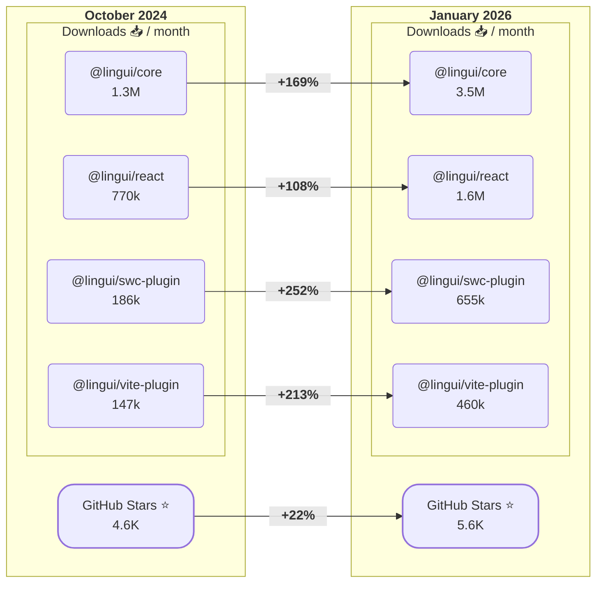
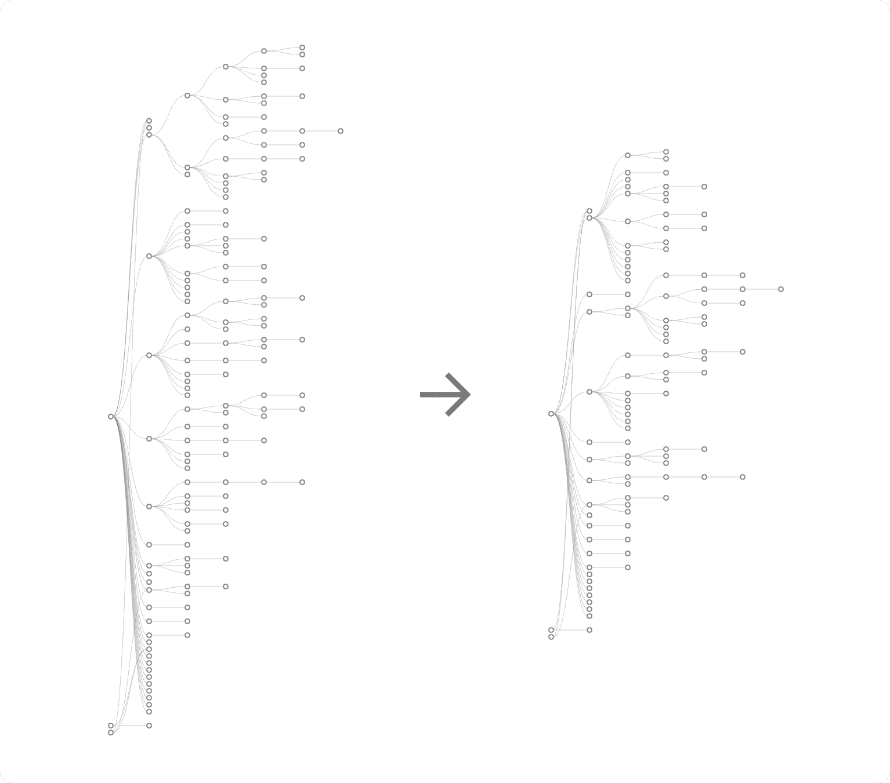

We're announcing Lingui 6.0! :rocket:

This release focuses primarily on **technical improvements and modernization** of the codebase. It includes the transition to ESM-only distribution, reduced dependency graph, removal of deprecated APIs, and improved TypeScript support. In this post, we'll highlight the key changes in this release.

In line with the principles of [Semantic Versioning](https://semver.org/), this release contains **breaking changes** that we have thoroughly documented in the [v6 migration guide](/releases/migration-6).


<!--truncate-->

## Table of Contents

- [What is Lingui?](#what-is-lingui)
- [Progress Highlights](#progress-highlights)
- [Recap](#recap)
  - [Ecosystem](#ecosystem)
  - [Embracing the AI Era](#embracing-the-ai-era)
  - [CLI Multithreading](#cli-multithreading)
  - [Explicit Placeholder Labels with `ph()`](#explicit-placeholder-labels-with-ph)
- [What's New in 6.0?](#whats-new-in-60)
  - [ESM-Only Distribution](#esm-only-distribution)
  - [Reduced Package Size](#reduced-package-size)
  - [Vue Extractor: support for Vue 3 Reactivity Transform](#vue-extractor-support-for-vue-3-reactivity-transform)
  - [Stronger Type Safety](#stronger-type-safety)
- [What's Next?](#whats-next)

## What is Lingui?

Lingui is an open-source JavaScript library for internationalization (i18n) and localization (l10n). Designed to make it easy for developers to build fully translated, multilingual applications, it offers support for React, React Native, Vue.js, Node.js, TypeScript, and more.

## Progress Highlights

The journey from [Lingui 5.0](/blog/2024/11/28/announcing-lingui-5.0) includes **18 version updates** (minor and patch), more than **117 closed issues**, and more than **130 merged pull requests**.

Before we dive into the changes in 6.0, let's take a look at the project's metrics since version 5.0. The project has grown significantly, with GitHub stars up 22% and downloads more than doubling across all packages:


```mermaid
%%{init: {"themeCSS": ".node rect { rx: 5; ry: 5; }"} }%%

graph LR
    subgraph OCT2024["<b>October 2024</b>"]
        stars1["GitHub Stars ⭐<br/>4.6K"]

        subgraph downloads1["Downloads 📥 / month"]
            A1["@lingui/core<br/>1.3M"]
            A2["@lingui/react<br/>770k"]
            A3["@lingui/swc-plugin<br/>186k"]
            A4["@lingui/vite-plugin<br/>147k"]
        end
    end

    subgraph JAN2026["<b>January 2026</b>"]
        stars2["GitHub Stars ⭐<br/>5.6K"]

        subgraph downloads2["Downloads 📥 / month"]
            B1["@lingui/core<br/>3.5M"]
            B2["@lingui/react<br/>1.6M"]
            B3["@lingui/swc-plugin<br/>655k"]
            B4["@lingui/vite-plugin<br/>460k"]
        end
    end

    stars1 -->|"<b>ㅤ+22%ㅤ</b>"| stars2
    A1 -->|"<b>ㅤ+169%ㅤ</b>"| B1
    A2 -->|"<b>ㅤ+108%ㅤ</b>"| B2
    A3 -->|"<b>ㅤ+252%ㅤ</b>"| B3
    A4 -->|"<b>ㅤ+213%ㅤ</b>"| B4

style stars1 stroke-width:2px,rx:20,ry:20
style stars2 stroke-width:2px,rx:20,ry:20
```

(_The download numbers are based on the [npm-stat.com](https://npm-stat.com/) data_)

Additionally, `eslint-plugin-lingui` has seen strong adoption, with monthly downloads growing from **~107k** to **~624k** (+483%) over the same period.

## Recap

Let's quickly review some of the major changes that have been released between 5.0 and 6.0.

### Ecosystem

We've introduced a new example project featuring Lingui + [TanStack Start](https://tanstack.com/start/latest)! Add internationalization to your TanStack Start apps using Lingui's powerful localization tools with Vite and Babel plugin integration.

📖 View the [TanStack Start example](https://github.com/lingui/js-lingui/tree/main/examples/tanstack-start).

### Embracing the AI Era

With the growing prevalence of AI-powered development tools, we've worked to ensure Lingui integrates seamlessly with this new paradigm.

We now provide [`llms.txt`](https://lingui.dev/llms.txt) and [`llms-full.txt`](https://lingui.dev/llms-full.txt) documentation files following the [llms.txt specification](https://llmstxt.org/), optimized for LLM context windows. [Context7](https://context7.com/lingui/js-lingui) provides Lingui documentation via MCP, allowing AI assistants to fetch up-to-date docs directly into prompts.

We've also released [Lingui Skills](https://github.com/lingui/skills) - Agent Skills that help AI coding assistants implement internationalization correctly. Available skills cover best practices and other helpful tips.

📖 See the [i18n with AI](/ai-tools) documentation page for more details.

### CLI Multithreading

The CLI received significant performance improvements with worker thread support. Multithreading is now available across all CLI commands: `extract`, `compile`, `extract-template`, and `extract-experimental` (the dependency-tree based extractor). Each command processes files, catalogs, or locales in parallel using a worker pool.

You can configure the number of worker threads with the `--workers` flag:

```bash
lingui extract --workers 4
```

By default, Lingui uses CPU cores - 1, capped at 8. Use `--workers 1` to disable multithreading and run in a single process.

### Explicit Placeholder Labels with `ph()`

The [`ph()`](/ref/macro#ph) macro allows labeling placeholders with meaningful names. Without it, complex
expressions become positional placeholders (`{0}`, `{1}`). With `ph()`, you can assign names that provide
better context for translators:

```diff
- t`Hello ${getUserName()}`;
+ t`Hello ${ph({ name: getUserName() })}`;
```

```diff
- msgid "Hello {0}"
- msgstr "Hello {0}"
+ msgid "Hello {name}"
+ msgstr "Hello {name}"
```

Named placeholders help translators understand _what_ the value represents, so they can choose the correct grammar or wording for the target language.

📖 Read more about the `ph()` macro in the [macro documentation](/ref/macro#ph).

## What's New in 6.0?

### ESM-Only Distribution

Lingui 6.0 is distributed as **ESM-only** (ECMAScript Modules). ESM is the official, standardized module system for JavaScript, and the ecosystem has largely converged on it. After years of shipping dual ESM/CommonJS builds, we've taken the step to simplify.

**Why ESM-only?** Dual builds came with real costs: they nearly doubled our package sizes, added maintenance complexity (conditionals, workarounds, and separate entry points), and occasionally led to subtle bugs from module duplication and dependency resolution. Going ESM-only makes Lingui smaller, simpler to maintain, and aligned with where the ecosystem is headed. With Node.js supporting [`require(esm)`](https://joyeecheung.github.io/blog/2024/03/18/require-esm-in-node-js/) in recent versions, the transition is smooth for most users.

Lingui 6.0 requires **Node.js v22.19+** (or v24+). This aligns with the ESM-only move and lets us rely on modern Node behavior without legacy workarounds.

### Reduced Package Size

Lingui 6.0 is noticeably lighter to install and maintain. Across the core packages, we cut both disk usage and transitive dependency count.

To make this representative of real projects, the numbers are calculated for `@lingui/core`, `@lingui/react`, and `@lingui/cli` together. Most apps use this combination, so measuring them as a set captures the practical install footprint better than showing each package in isolation.

#### `node_modules` Footprint

The combined install of `@lingui/core` + `@lingui/react` + `@lingui/cli` dropped from **62 MB to 35 MB** — a ~44% reduction. That means faster `npm install`, lighter CI caches, and less disk clutter on every developer's machine.

#### Dependency Count

The transitive dependency tree shrank from **146 packages down to 104** — 42 fewer packages to resolve, download, and audit on every install. The graph below shows just how much the tree thinned out:



### Vue Extractor: support for Vue 3 Reactivity Transform

The Vue extractor now supports [Vue's Reactivity Transform](https://github.com/vuejs/rfcs/discussions/502) (reactive props destructure in `<script setup>`). In Vue 3, destructuring props from `defineProps()` is compiled in a way that can change how variables appear in the generated code. If the extractor runs on the raw source while your app runs on the compiled output, message IDs can diverge and translations may not resolve at runtime.

To align extraction with your build, use the new `createVueExtractor()` factory and enable the `reactivityTransform` option when your project uses the transform:

```js title="lingui.config.{js,ts}"
import { createVueExtractor } from "@lingui/extractor-vue";

extractors: [babel, createVueExtractor({ reactivityTransform: true })],
```

The option is opt-in (`reactivityTransform: false` by default) so existing setups keep working.

### Stronger Type Safety

Lingui 6.0 tightens TypeScript types for better safety across core packages.

Several packages now use stricter nullability behavior, and optional values are handled consistently with TypeScript conventions (e.g. `undefined` instead of `null` where appropriate). We've also clarified the separation between extracted-message shapes and loaded-catalog message shapes for better type accuracy in custom extractors, formatters, or tooling.

Most apps are unaffected, but custom integrations may need small updates.

## What's Next?

<!-- TODO: Links to all commits and PRs, acknowledge contributions -->
