Today we are pleased to announce the release of Lingui 6.0! :rocket:

This release focuses primarily on **technical improvements and modernization** of the codebase. It includes the transition to ESM-only distribution, removal of deprecated APIs, and improved TypeScript support. In this post, we'll highlight the key changes in this release.

In line with the principles of [Semantic Versioning](https://semver.org/), this release contains **breaking changes** that we have thoroughly documented in the [v6 migration guide](/releases/migration-6).


<!--truncate-->

## Table of Contents

- [What is Lingui?](#what-is-lingui)
- [Progress Highlights](#progress-highlights)
- [Recap](#recap)
  - [Ecosystem](#ecosystem)
  - [Embracing the AI Era](#embracing-the-ai-era)
  - [CLI Multithreading](#cli-multithreading)
  - [Explicit Placeholder Labels with `ph()`](#explicit-placeholder-labels-with-ph)
  - [Enhanced Date/Time Formatting](#enhanced-datetime-formatting)
- [What's New in 6.0?](#whats-new-in-60)
  - [ESM-Only Distribution](#esm-only-distribution)
  - [Configuration Changes](#configuration-changes)
  - [The `@lingui/macro` Package No Longer Maintained](#the-linguimacro-package-no-longer-maintained)
  - [TypeScript Improvements](#typescript-improvements)
  - [Developer Experience Improvements](#developer-experience-improvements)
- [What's Next?](#whats-next)

## What is Lingui?

Lingui is an open-source JavaScript library for internationalization (i18n) and localization (l10n). Designed to make it easy for developers to build fully translated, multilingual applications, it offers support for React, React Native, Vue.js, Node.js, TypeScript, and more.

## Progress Highlights

The journey from [Lingui 5.0](/blog/2024/11/28/announcing-lingui-5.0) includes **18 version updates** (minor and patch), more than **117 closed issues**, and more than **130 merged pull requests**.

Before we dive into the changes in 6.0, let's take a look at the project's metrics since version 5.0. The project has grown significantly, with GitHub stars up 22% and downloads more than doubling across all packages:

```mermaid
%%{init: {"themeCSS": ".node rect { rx: 5; ry: 5; }"} }%%

graph LR
    subgraph NOV2024["<b>October 2024</b>"]
        stars1["GitHub Stars ⭐<br/>4.6K"]

        subgraph downloads1["Downloads 📥 / month"]
            A1["@lingui/core<br/>1.3M"]
            A2["@lingui/react<br/>770k"]
            A3["@lingui/swc-plugin<br/>186k"]
            A4["@lingui/vite-plugin<br/>147k"]
            A5["eslint-plugin-lingui<br/>107k"]
        end
    end

    subgraph JAN2026["<b>January 2026</b>"]
        stars2["GitHub Stars ⭐<br/>5.6K"]

        subgraph downloads2["Downloads 📥 / month"]
            B1["@lingui/core<br/>3.5M"]
            B2["@lingui/react<br/>1.6M"]
            B3["@lingui/swc-plugin<br/>655k"]
            B4["@lingui/vite-plugin<br/>460k"]
            B5["eslint-plugin-lingui<br/>624k"]
        end
    end

    stars1 -->|"<b>ㅤ+22%ㅤ</b>"| stars2
    A1 -->|"<b>ㅤ+169%ㅤ</b>"| B1
    A2 -->|"<b>ㅤ+108%ㅤ</b>"| B2
    A3 -->|"<b>ㅤ+252%ㅤ</b>"| B3
    A4 -->|"<b>ㅤ+213%ㅤ</b>"| B4
    A5 -->|"<b>ㅤ+483%ㅤ</b>"| B5

style stars1 stroke-width:2px,rx:20,ry:20
style stars2 stroke-width:2px,rx:20,ry:20
```



(_The download numbers are based on the [npm-stat.com](https://npm-stat.com/) data_)

## Recap

Let's quickly review some of the major changes that have been released between 5.0 and 6.0.

### Ecosystem

We've introduced a new example project featuring Lingui + [TanStack Start](https://tanstack.com/start/latest)! Easily add internationalization to your TanStack Start apps using Lingui's powerful localization tools with Vite and Babel plugin integration.

📖 View the [TanStack Start example](https://github.com/lingui/js-lingui/tree/main/examples/tanstack-start).

### Embracing the AI Era

With the growing prevalence of AI-powered development tools, we've worked to ensure Lingui integrates seamlessly with this new paradigm.

We now provide [llms.txt](https://lingui.dev/llms.txt) and [llms-full.txt](https://lingui.dev/llms-full.txt) documentation files following the [llms.txt specification](https://llmstxt.org/), optimized for LLM context windows. [Context7](https://context7.com/lingui/js-lingui) provides Lingui documentation via MCP, allowing AI assistants to fetch up-to-date docs directly into prompts.

We've also released [Lingui Skills](https://github.com/lingui/skills) - Agent Skills that help AI coding assistants implement internationalization correctly. Available skills cover best practices and other helpful tips. Install with:

```bash
npx skills add lingui/skills
```

### CLI Multithreading

The CLI received significant performance improvements with worker thread support. Multithreading is now available across all CLI commands: `extract`, `compile`, `extract-template`, and `extract-experimental` (the dependency-tree based extractor). Each command processes files, catalogs, or locales in parallel using a worker pool.

You can configure the number of worker threads with the `--workers` flag:

```bash
lingui extract --workers 4
```

By default, Lingui uses CPU cores - 1, capped at 8. Use `--workers 1` to disable multithreading and run in a single process.

### Explicit Placeholder Labels with `ph()`

The [`ph()`](/ref/macro#ph) macro allows labeling placeholders with meaningful names. Without it, complex expressions become positional placeholders (`{0}`, `{1}`). With `ph()`, you can assign names that provide better context for translators:

```js
// Without ph(): "Hello {0}"  →  With ph(): "Hello {name}"
t`Hello ${ph({ name: getUserName() })}`;
```

📖 Read more about the `ph()` macro in the [macro documentation](/ref/macro#ph).

### Enhanced Date/Time Formatting

Dates and times in messages are now formatted according to the active locale using ICU standard format styles (`short`, `default`, `long`, `full`):

```js
// {someDate, date, short}  → "12/06/2014"
// {someDate, date, long}   → "December 6, 2014"
// {someDate, time, short}  → "17:40"
// {someDate, time, full}   → "17:40:00 UTC"
```

## What's New in 6.0?

### ESM-Only Distribution

<!-- TODO: focus advantages, some background, bundle size, etc. -->

#### Node.js Version Requirement

### Configuration Changes

#### Deprecated `format` String and `formatOptions` Removed

#### YAML Configuration Support Removed

### The `@lingui/macro` Package No Longer Maintained

### TypeScript Improvements

### Developer Experience Improvements

#### Migration from Jest to Vitest

#### Monorepo Infrastructure

## What's Next?

<!-- TODO: Links to all commits and PRs, acknowledge contributions -->
