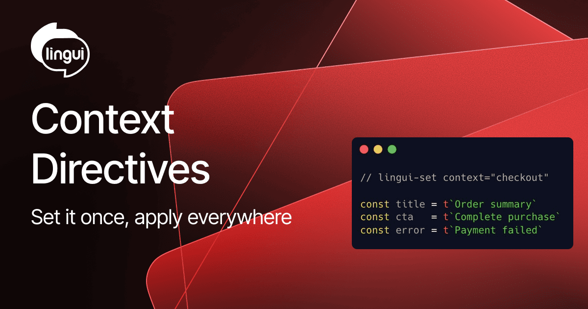

One of Lingui's biggest ergonomic wins is keyless translations - you write the source string directly in your code and Lingui generates a stable ID for you. But that convenience quietly breaks down the moment you need `context` to prevent collisions across files. Suddenly you're writing `context: "checkout"` on every macro call in every file, which defeats the whole point.



<!--truncate-->

## Context isn't just deduplication

It's worth pausing on _why_ context matters beyond avoiding ID collisions. The same source string can have genuinely different correct translations depending on where it appears. "Save" in a settings panel, a payment form, and a destructive-action confirmation dialog may all translate differently in many languages. Without context, translators (human or AI) are forced to guess from the string alone, and those guesses introduce subtle but real quality issues that are hard to catch until they reach users.

Providing accurate context is one of the most impactful things you can do for translation quality. The trouble is that doing it consistently has always required repetitive boilerplate.

## The solution: `lingui-set` and `lingui-reset`

The new comment directives let you declare `context`, `comment`, and `idPrefix` **once** for a block of macro calls rather than on each one individually:

```js
import { t } from "@lingui/core/macro";

// lingui-set context="checkout" comment="Checkout page strings"
const title = t`Order summary`;
const cta = t`Complete purchase`;
const error = t`Payment failed`;
// All three inherit context="checkout" and the translator note
```

Both line comments (`//`) and block comments (`/* */`) are supported.

## Merging, overriding, and resetting

Directives accumulate across a file - each `lingui-set` merges its values with whatever was set before. Explicit macro props always win over directive values. Use `lingui-reset` to clear the slate:

```js
import { t } from "@lingui/core/macro";

// lingui-set context="settings" comment="Settings page"
const save = t`Save`; // context="settings", comment="Settings page"
const cancel = t`Cancel`; // context="settings", comment="Settings page"

// lingui-set comment="Danger zone"
const delete_ = t`Delete account`; // context="settings", comment="Danger zone"

// lingui-reset
const footer = t`Powered by Acme`; // no context, no comment
```

Setting a param to an empty string unsets just that key while keeping others:

```js
// lingui-set context=""
// context is removed; other inherited values remain
```

The directives work with React/JSX macros too:

```jsx
import { Trans } from "@lingui/react/macro";

{/* lingui-set context="homepage" */}
<Trans>Welcome back</Trans>
<Trans>Sign out</Trans>
```

## Namespacing explicit IDs with `idPrefix`

For teams using explicit IDs, the `idPrefix` param lets you namespace a whole group of IDs without repeating the prefix manually. Combined with the optional [`macro.idPrefixLeader`](/ref/conf#macroidprefixleader) config, you can make prefixing opt-in - only IDs that start with the leader string are prefixed, leaving others untouched:

```js
// lingui.config - make "." the opt-in leader
export default { macro: { idPrefixLeader: "." } };
```

```js
// lingui-set idPrefix="nav"
const links = {
  home: t({ id: ".home", message: "Home" }), // → "nav.home"
  account: t({ id: ".account", message: "Account" }), // → "nav.account"
  fixed: t({ id: "global.tos", message: "Terms" }), // → "global.tos" (no leader)
};
```

## Try it out

`lingui-set` and `lingui-reset` are available in the latest Lingui release. Full reference - including the supported params, syntax variants, and scoping rules - is in the [macro docs](/ref/macro#lingui-directive).

This feature is marked as new and we'd love your feedback. Drop by [GitHub Discussions](https://github.com/lingui/js-lingui/discussions) and let us know how it works for your project.

Big thanks to [@mogelbrod](https://github.com/mogelbrod) for the original proposal and implementation!
