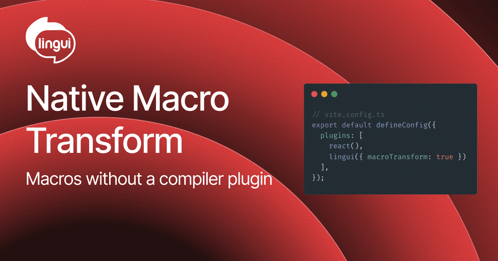

Lingui macros have always needed a compiler plugin: Babel or SWC turns `` t`Hello` `` and `<Trans>` into runtime calls at build time. In Vite that meant wiring the macro plugin into whichever compiler your framework plugin uses. The new native macro transform removes that step. One option in `vite.config.ts`, and `@lingui/vite-plugin` transforms macros itself.



<!--truncate-->

## One option instead of a plugin

Enable `macroTransform` in the Lingui Vite plugin and you're done:

```ts title="vite.config.ts"
import { defineConfig } from "vite";
import react from "@vitejs/plugin-react";
import { lingui } from "@lingui/vite-plugin";

export default defineConfig({
  plugins: [react(), lingui({ macroTransform: true })],
});
```

No Babel plugin, no SWC plugin, no `@rolldown/plugin-babel`. The setup works the same with `@vitejs/plugin-react`, `@vitejs/plugin-react-swc` and Vite 8+ with Rolldown. If you install Lingui into a fresh Vite app today, this is the recommended path.

`macroTransform: true` is enough for most projects. If you need to override macro or parser options, see the [Vite plugin docs](/ref/vite-plugin#options-reference).

Already using the Babel or SWC macro plugin? Enable `macroTransform` and remove the Lingui macro plugin from your config. The [migration steps](/ref/vite-plugin#migrating-to-the-native-macro-transform) cover the details. Existing Babel and SWC setups keep working, and the native transform will become the default in the next major release.

## How it works

The transform is powered by [`@lingui/native-tools`](https://www.npmjs.com/package/@lingui/native-tools), a Rust-based toolchain built specifically for Lingui. It only runs on files that import a macro and reads its options from your [Lingui configuration](/ref/conf).

The output matches the Babel and SWC plugins, so switching shouldn't change how your app behaves.

Speed is the obvious benefit. In the `@lingui/native-tools` macro transform benchmark, the native transformer is roughly **2.5x faster than SWC** with the Lingui plugin and almost **30x faster than Babel**. In a Vite dev server that can mean faster cold starts and quicker HMR in message-heavy files.

The less obvious one is simplicity. With Vite 8 moving to Rolldown, Babel is no longer part of the default pipeline, and Babel users had to bring it back through `@rolldown/plugin-babel` just for Lingui. The native transform makes Lingui independent of the compiler your framework plugin happens to use.

The same transform also backs the built-in esbuild and Rolldown bundlers of [`lingui extract-experimental`](/guides/message-extraction#dependency-tree-crawling), with a `macroTransform` option to override its settings when necessary.

## Try it out

The native macro transform is available in the latest release of `@lingui/vite-plugin` and `@lingui/cli`. Enable it, run your dev server or extraction and let us know how it goes in [GitHub Discussions](https://github.com/lingui/js-lingui/discussions). If you hit a platform or syntax the transform doesn't handle, please [open an issue](https://github.com/lingui/js-lingui/issues).
