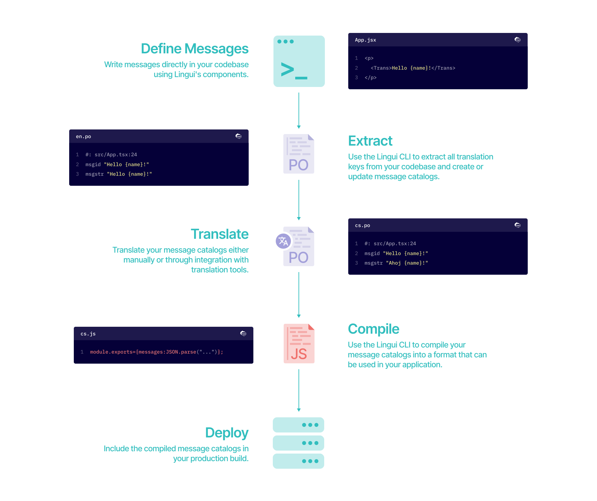

# Introduction

📖 A readable, automated, and optimized internationalization for JavaScript

> **Internationalization** is the design and development of a product, application or document content that enables easy **localization** for target audiences that vary in culture, region, or language.
>
> — [W3C Web Internationalization FAQ](https://www.w3.org/International/questions/qa-i18n)

[](https://github.com/lingui/js-lingui/)

## Key Features

Lingui is an easy yet powerful internationalization framework for global projects.

### Clean and Readable

Keep your code clean and readable, while the library uses battle-tested and powerful **ICU MessageFormat** under the hood.

### Universal

Use it everywhere. [`@lingui/core`](./ref/core.md) provides the essential intl functionality which works in any JavaScript project, while [`@lingui/react`](./ref/react.md) offers components for leveraging React rendering, including React Server Components (RSC) support.

### Full Rich-text Support

Seamlessly use React components within localized messages, without any restrictions. Creating rich-text messages feels just like writing JSX.

### Powerful Tooling

Manage your intl workflow with the Lingui [CLI](./ref/cli.md), [Vite Plugin](./ref/vite-plugin.md), and [ESLint Plugin](./ref/eslint-plugin.md). The CLI extracts, compiles and validates messages, while the Vite plugin compiles catalogs on the fly, and the ESLint plugin helps catch common usage errors.

### Unopinionated

Integrate Lingui into your existing workflow. It supports explicit message keys as well as auto-generated ones. Translations are stored either in JSON or standard PO file, which is supported in almost all translation tools.

### Lightweight and Optimized

Core library is less than [3 kB gzipped](https://bundlephobia.com/result?p=@lingui/core), React components are additional [1.4 kB gzipped](https://bundlephobia.com/result?p=@lingui/react).

### AI Translations Ready

For AI to do great translations for you, context is critical. Translating UI copy is difficult because it's usually a list of short strings without enough context. Lingui's localization formats allow developers to write descriptions of where and how your keys are used. This allows both human translators and AI to make better translations.

### Active Community

Join the growing [community of developers](/community) who are using Lingui to build global products.

## Workflow

Using Lingui for internationalization is a straightforward process. Here's a high-level overview of the workflow.



### Define Messages

Write messages directly in your codebase using Lingui's components. This keeps your code clean and readable while embedding translations naturally.

### Extract

Use the Lingui CLI to extract all translatable messages from your codebase and create or update message catalogs. This step ensures that all messages are captured and ready for translation.

### Translate

Translate your message catalogs either manually or through integration with translation tools.

### Compile

Use the Lingui CLI to compile your message catalogs into a format that can be used in your application. This step minimizes the size of your translation bundle and ensures that only the necessary data is bundled.

### Deploy

Include the compiled message catalogs in your production build to ensure that users receive localized content based on their language preferences.

## Quick Overview

```jsx
import React from "react";
import { Trans, Plural, useLingui } from "@lingui/react/macro";

export default function Lingui({ numUsers, name = "You" }) {
  const { t } = useLingui();

  return (
    <div>
      <h1>
        {/* Localized messages are simply wrapped in <Trans> */}
        <Trans>Internationalization in React</Trans>
      </h1>

      {/* Element attributes are translated using t macro */}
      

      <p>
        {/* Variables are passed to messages in the same way as in JSX */}
        <Trans>Hello {name}, Lingui is a readable, automated, and optimized i18n for JavaScript.</Trans>
      </p>

      {/* React Elements inside messages works in the same way as in JSX */}
      <p>
        <Trans>
          Read the <a href="https://lingui.dev">documentation</a>
          for more info.
        </Trans>
      </p>

      {/*
        Plurals are managed using ICU plural rules.
        Nesting of i18n components is allowed.
        Syntactically valid message in ICU MessageFormat is guaranteed.
      */}
      <Plural
        value={numUsers}
        one={
          <span>
            Only <strong>one</strong> user is using this library!
          </span>
        }
        other={
          <span>
            <strong>{numUsers}</strong> users are using this library!
          </span>
        }
      />
    </div>
  );
}
```

## See Also

- [Installation and Setup](./installation.mdx)
