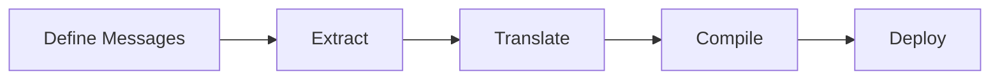

# Introduction

📖 A readable, automated, and optimized internationalization for JavaScript

> **Internationalization** is the design and development of a product, application or document content that enables easy **localization** for target audiences that vary in culture, region, or language.
>
> — [W3C Web Internationalization FAQ](https://www.w3.org/International/questions/qa-i18n)

[](https://github.com/lingui/js-lingui/)

## Key Features

Lingui is an easy yet powerful internationalization framework for global projects.

### Clean and Readable

Keep your code clean and readable, while the library uses battle-tested and powerful **ICU MessageFormat** under the hood.

### Lightweight and Optimized

Core library [](https://bundlejs.com/?q=%40lingui%2Fcore), React components [](https://bundlejs.com/?q=%40lingui%2Freact&config=%7B%22esbuild%22%3A%7B%22external%22%3A%5B%22react%22%2C%22%40lingui%2Fcore%22%5D%7D%7D).

### Universal

Use it everywhere. [`@lingui/core`](/ref/core) is the framework-agnostic layer: it loads compiled catalogs, keeps track of the active locale, and formats messages with ICU MessageFormat - the same behavior in the browser, on a Node server, or in a small script.

If you are not using a UI framework, the [JavaScript tutorial](/tutorials/javascript) shows how to wire up core macros and catalogs from scratch.

For React apps, [`@lingui/react`](/ref/react) adds components and hooks that follow the renderer's lifecycle, including [React Server Components](/tutorials/react-rsc). For React Native, the [React Native tutorial](/tutorials/react-native) uses the same extract-and-compile workflow. Lingui is also compatible with Astro and Svelte via community-supported packages.

### Full Rich-text Support

Seamlessly use React components within localized messages, without any restrictions. Creating rich-text messages feels just like writing JSX.

This keeps message catalogs in sync with the source code, preventing obsolete messages and lowering translation costs.

### Powerful Tooling

Manage your intl workflow with the Lingui [CLI](/ref/cli), [Vite Plugin](/ref/vite-plugin), and [ESLint Plugin](/ref/eslint-plugin). The CLI extracts, compiles and validates messages, while the Vite plugin compiles catalogs on the fly, and the ESLint plugin helps catch common usage errors.

### Unopinionated

Integrate Lingui into your existing workflow. It supports explicit message keys as well as auto-generated ones. Translations are stored in a standard PO file, which is supported by almost all translation tools. You can also use CSV or JSON, or add a custom formatter of your own.

### Built for AI-assisted Workflows

For AI to do great translations for you, context is critical. Translating UI copy is difficult because it's usually a list of short strings without enough context. Lingui's localization formats allow developers to write descriptions of where and how their keys are used.

Install [`lingui/skills`](https://github.com/lingui/skills) to help your AI assistant understand Lingui patterns and apply them consistently across your project. For context files, MCP setup, and more, see [i18n with AI](/ai-tools).

### Active Community

Join the growing [community of developers](/community) who are using Lingui to build global products.

## Workflow

Using Lingui for internationalization is a straightforward cycle. You define messages in code, extract them into catalogs, translate, compile optimized runtime output, and ship localized builds.


```mermaid
flowchart LR
  A[Define Messages] --> B[Extract]
  B --> C[Translate]
  C --> D[Compile]
  D --> E[Deploy]
```

### Define Messages

Write user-facing text where it is used, using Lingui macros/components such as `Trans` and `t`. Keep messages close to the UI logic so they stay maintainable, and add context (for example comments or descriptions) for better translation quality.

### Extract

Run the Lingui CLI to scan your source files and collect translatable messages into catalog files (PO by default). Extraction updates existing catalogs, adds new messages, and marks removed ones so translators always work with the latest source text.

### Translate

Translate the extracted catalogs manually or with your localization platform. Translators work on stable message IDs/source messages, preserving placeholders and ICU syntax so runtime formatting remains correct.

### Compile

Compile catalogs into optimized JavaScript modules for runtime usage. Compilation validates message syntax and prepares only the data your app needs, reducing bundle size and startup overhead.

### Deploy

Ship compiled catalogs with your app and load the right locale based on user preference or app settings. In production, this gives users fast localized rendering and lets you repeat the same workflow whenever copy changes.

## Quick Overview

```jsx
import React from "react";
import { ph } from "@lingui/core/macro";
import { Trans, Plural, useLingui } from "@lingui/react/macro";

export default function Lingui({ numUsers, user }) {
  const { t } = useLingui();

  return (
    <div>
      <h1>
        {/* Localized messages are wrapped in <Trans> */}
        <Trans>Internationalization in React</Trans>
      </h1>

      {/* Element attributes are translated using the t macro */}
      

      <p>
        {/*
          ph() gives placeholders explicit names when using expressions.
          This improves context for translators.
        */}
        <Trans>
          Hello {ph({ userName: user.name })}, Lingui is a readable, automated, and optimized i18n for JavaScript.
        </Trans>
      </p>

      {/* React elements inside messages work in the same way as in JSX */}
      <p>
        <Trans>
          Read the <a href="https://lingui.dev">documentation</a> for more info.
        </Trans>
      </p>

      {/*
        Plurals are managed using ICU plural rules.
        Nesting of i18n components is allowed.
        Syntactically valid message in ICU MessageFormat is guaranteed.
      */}
      <Plural
        value={numUsers}
        one={
          <span>
            Only <strong>one</strong> user is using this library!
          </span>
        }
        other={
          <span>
            <strong>{numUsers}</strong> users are using this library!
          </span>
        }
      />
    </div>
  );
}
```

## See Also

- [Installation and Setup](/installation)
- [i18n with AI](/ai-tools)
