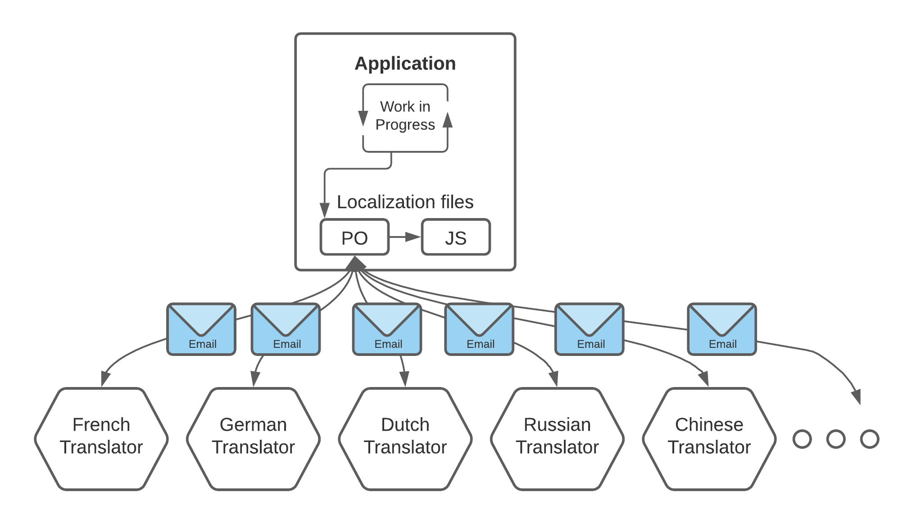
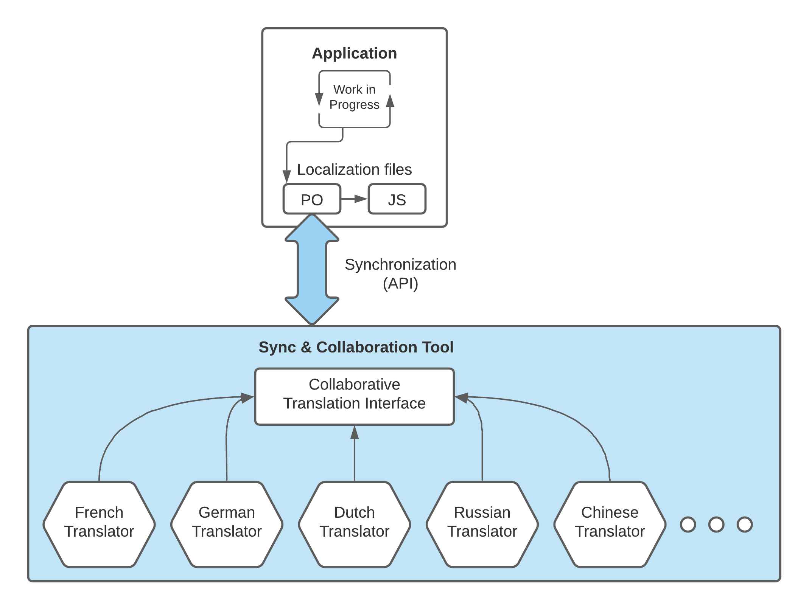

# Introduction

This guide covers tools that will help managing of your localization process. You may come across abbreviations TMS (translation management system) or CAT (computer-aided translation) that are sometimes used to describe these tools.

## Why use Sync & Collaboration Tools?

The easiest way to translate your application is to translate the `.po` files directly in a text editor, or with a tool like [Poedit](https://poedit.net).

This solution may be good enough when your application is still small and doesn't evolve much, but it quickly becomes hard work when the number of sentences to translate and the target languages to manage increase with time.

It then becomes more and more difficult and time-consuming to manage the back and forth with the translators, while keeping your application `.po` files up-to-date with the current state of a codebase that doesn't stop evolving.

That's why sync and collaboration tools are directly integrated into Lingui to help structure your work with your translators team, to ensure the consistency of the translations, and to make your life easier.

### Regular Workflow

This is the most basic workflow which involves sending the `.po` files to your translators (usually by email) and syncing them back manually into your application.

This workflow is manageable when your application is still quite small, doesn't contain a lot of text, and doesn't evolve much.

### Sync & Collaboration Tool Workflow

When the amount of text to translate increases, and the number of target languages grows, it becomes more efficient to use a sync and collaboration tool to assist you with the management of your team of translators, and co-evolution between your code and the translated files.

Instead of manually sending and receiving many emails and fixing the inconsistencies with your code, a `sync` method is called and your `.po` and `.js` files are directly updated with the latest translations. Your translators will also be notified when there are new text to translate.

## Benefits of these tools

- **Synchronization**: unique `yarn sync` or `npm run sync` command to synchronize your project with all your translators and update your local `.po` and `.js` files with the latest translations.
- **Translation Interface**: provide a professional and flexible interface to translators.
- **Translation Memory**: assist translators by suggesting previously translated sentences that are similar.
- **Machine Translation**: auto-translate with Google Translate, DeepL, etc. and human-proofread later.
- **Smart Plural Management**: allows to translate `Message` and `Messages` instead of `{count, plural, one {Message} other {Messages}}`.
- **Consistency**: assist translators with `{variable}` interpolation and HTML formatting.

## List of available tools

### [Crowdin](https://crowdin.com/?utm_source=lingui.dev&utm_medium=referral&utm_campaign=lingui.dev)

- Documentation: [Crowdin](./crowdin.md)
- GitHub: https://github.com/crowdin

### [Translation.io](https://translation.io/lingui)

- Documentation: [translation-io](./translation-io.md)
- GitHub: https://github.com/translation/lingui
